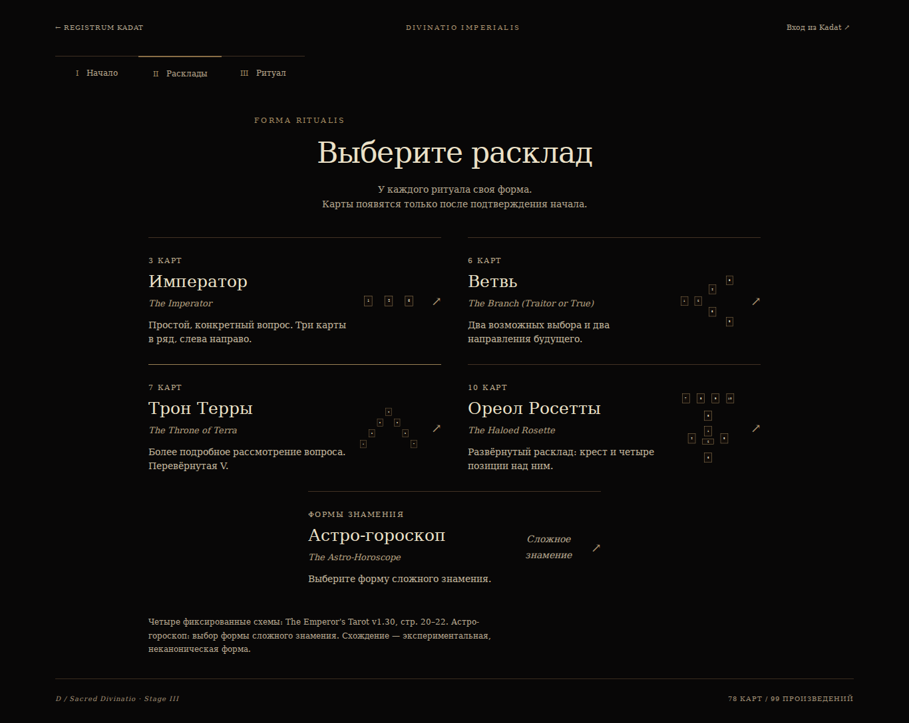
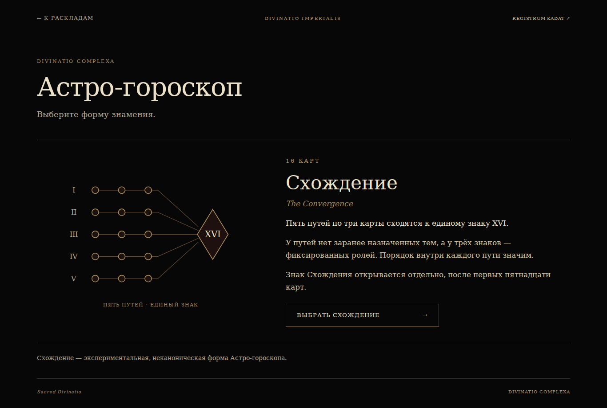
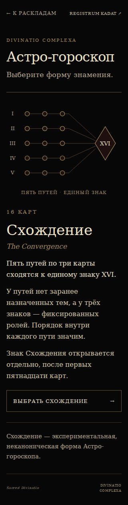
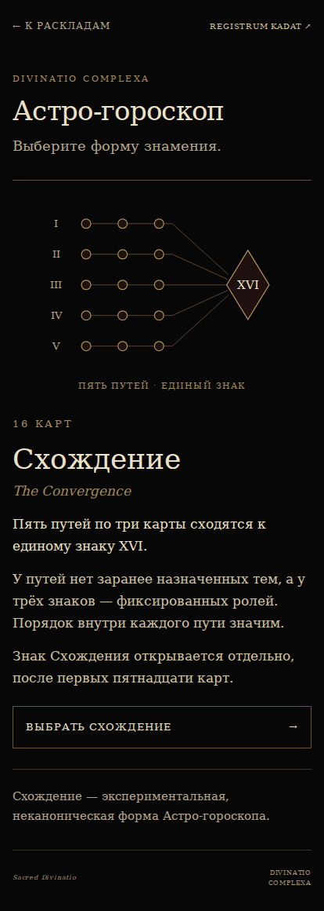
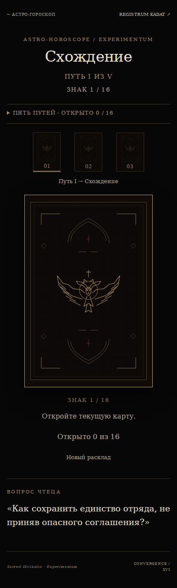
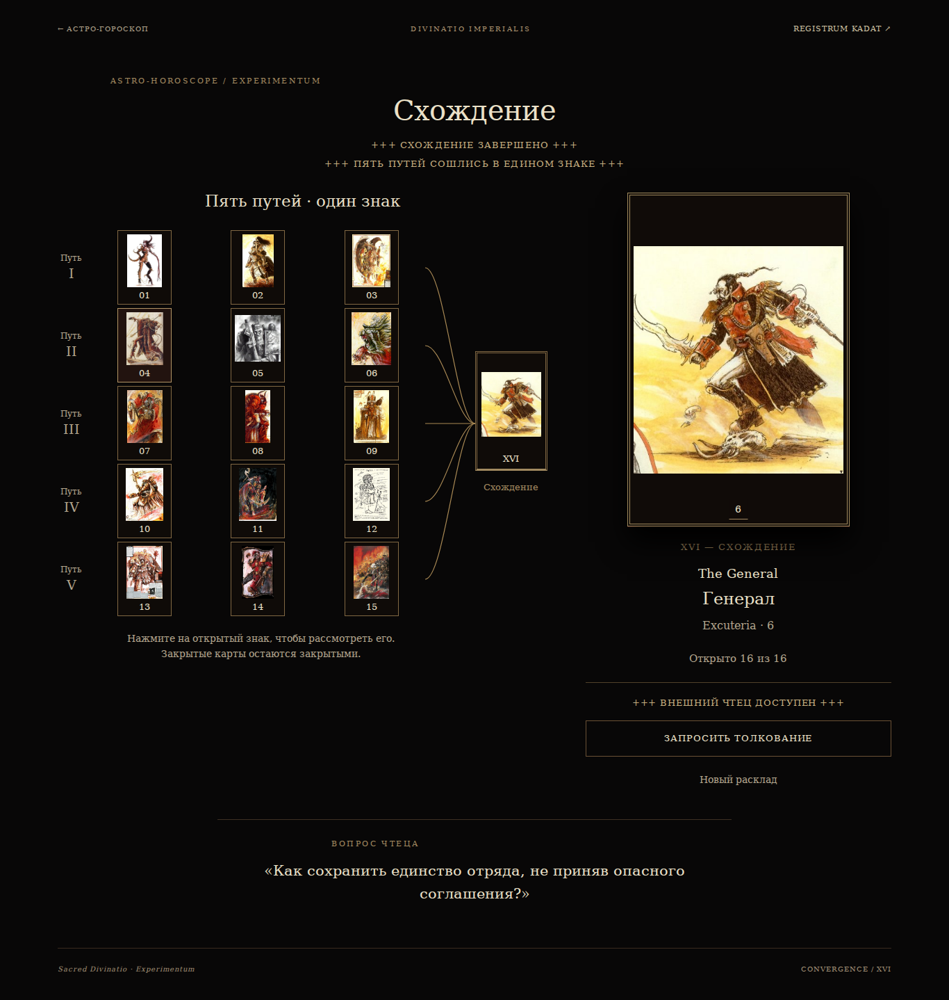

# Stage 5B-3 — Astro-Horoscope production entry

Branch: `experiment/imperial-tarot-astro-entry`  
Baseline: `e7c9835bc585fe10bb027090aeba4ddb68ad138c`  
Validation: **40/40 PASS**, one bounded pass, no targeted rechecks.  
Browser/resource errors: **0**. External requests: **0**. Interpretation calls: **0**.

The main spread list retains its five choices. Astro-Horoscope now opens a separate Sacred Divinatio form-selection page. Only Convergence is offered, explicitly described as an experimental, non-canonical form with five ordered paths of three cards and the separate final sign XVI.

Selecting Convergence navigates to the existing implementation. Its header returns to Astro form selection; that page returns directly to the main spread list through a consumed `screen=spreads` navigation parameter. Saved Tarot rituals are retained, and a completed Convergence session survives leaving and re-entering through this hierarchy.

## Source changes

| File | Change |
| --- | --- |
| `tarot-prototype/stage2.js` | Astro entry action, Astro-only selection copy, and direct return to spreads. |
| `tarot-prototype/index.html` | Updated cache version for the navigation controller. |
| `tarot-prototype/astro-horoscope/index.html` | Static form-selection page with one available form and the five-path diagram. |
| `tarot-prototype/astro-horoscope/forms.css` | Scoped form-selection layout and readable mobile styling. |
| `tarot-prototype/experiment-convergence/index.html` | Header back link only. All ritual and Reader imports remain unchanged. |

Validation harness: [`../validate-stage5b3.cjs`](../validate-stage5b3.cjs). Results: [`validation.json`](validation.json).

## Bounded review

The four canonical choices were opened to their existing preparation screens; no canonical interpretation suite was run. One Convergence session was entered through the new navigation and revealed in order. XVI remained closed until its separate action; Reader was locked before it and became available after completion. Clipboard content matched the entire plain-text preview. DeepSeek and ChatGPT links were inspected without opening either service. Leaving and re-entering preserved the question, all sixteen card identities/states and completed progress.

Desktop 1366 px and mobile 320/414 px passed. Form body text is 17 px on both phones, the navigation and action are accessible, and no horizontal overflow was found. The six captures below were generated once and visually reviewed.

Frozen data, interpretation engine, prompt generator, Reader code, artwork/mappings, canonical spread mechanics, Archive and four Kadat generators have no changes. The old 24-card Astro implementation remains intact. The unrelated `adeptio_07.jpg` modification in the original worktree is excluded and untouched.

## Screenshots

1. Main spread selection: five choices, Astro form entry.

   

2. Astro-Horoscope form selection, desktop 1366 px.

   

3. Astro-Horoscope form selection, mobile 320 px.

   

4. Astro-Horoscope form selection, mobile 414 px.

   

5. Existing Convergence reached through the new navigation, Path I, mobile 414 px.

   

6. Completed Convergence, all sixteen cards open, Reader available.

   

Known issues: **NONE**. No main merge or GitHub Pages publication is part of this checkpoint.
