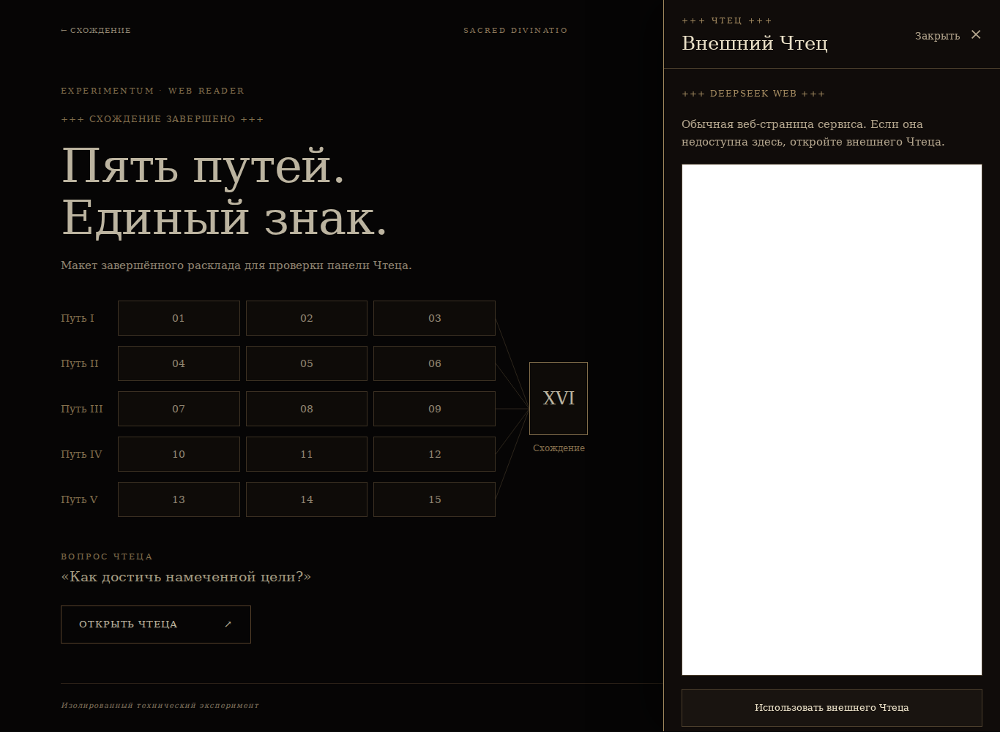
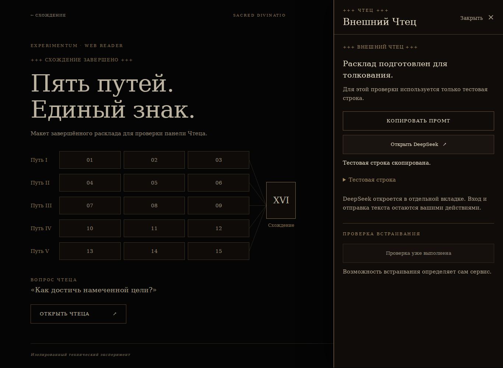
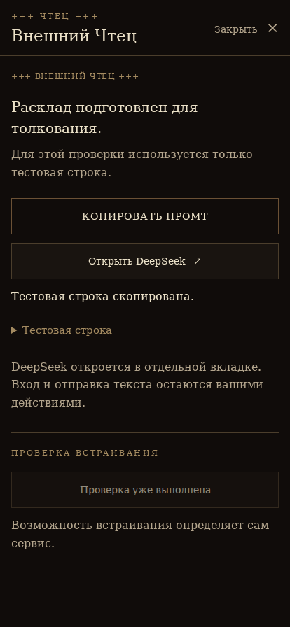

# Stage 5B-0 review — external Reader feasibility

Branch: `experiment/imperial-tarot-deepseek-embed`

Baseline: `496f2b6838842df0a2a37cc92d6ad497e38cc697`

Production baseline: `0dc66e6db4522276de7536ac8292af587b26e4a8`

Checkpoint: the single commit containing this review; exact SHA is in the delivery report.

## Direct embed observation

**PARTIAL.** Exactly one iframe navigation to the official web chat
`https://chat.deepseek.com/` was attempted in Chromium 153, from a local HTTP
page, with normal TLS, CSP and cross-origin protections enabled.

The browser recorded **`net::ERR_EMPTY_RESPONSE`**. The iframe remained blank.
No document response was available, and no CSP/X-Frame-Options refusal appeared
in the console. The frame screenshot therefore shows the actual blank result,
not a fabricated policy error. This environment could not establish whether
DeepSeek permits embedding. Direct embed is **not approved as viable**.

A supplementary HEAD request received **HTTP 403 / CloudFront**; see
[the transport observation](http-head-observation.txt). This also does not
establish a service framing policy.

Login/session UI: **NOT TESTABLE**. No credentials, cookies, remote DOM, CAPTCHA,
or prompt submission were accessed. No restrictions were bypassed. No further
embed attempts were made after the observed failure.

## Fallback and bounded UI result

One bounded pass: **PASS 20/20**. The test covers isolation, preservation,
recording the actual negative/limited result, manual fallback controls and
responsive layout. It does not certify that the remote service is usable.
Full check results and browser evidence: [validation.json](validation.json).

| Check | Result |
| --- | --- |
| Fallback Reader | PASS |
| Mock text copied to clipboard | PASS |
| Official URL opened in new top-level tab | PASS |
| DeepSeek service loaded in that tab | NOT AVAILABLE — `chrome-error://chromewebdata/` |
| Desktop 1366 × 1000 | PASS — right-side 460 px panel |
| Mobile 320 × 896 | PASS — full-width overlay, scrollable content |
| Mobile 414 × 896 | PASS — full-width overlay, scrollable content |
| Horizontal overflow, shell and Reader | NONE at all three widths |
| Keyboard Escape / return focus | PASS |
| API calls / API keys / backend implemented | 0 / 0 / NONE |

Only static mock content is used. The future Convergence prompt generator is
not implemented. The mock question is not analyzed. Stage 5A, production,
canonical Tarot, Stage 4A, engine, artwork mappings, Archive and all four Kadat
generators retain their baseline bytes. No main merge or production deployment.

## Four screenshots captured once

### 1. Attempted direct embed — desktop

### 2. Actual browser result — blank frame

Browser request failure: `net::ERR_EMPTY_RESPONSE`. See the `failedRequests`
field in [validation.json](validation.json). The browser did not render a
visible error message inside this frame.

### 3. Manual fallback — desktop 1366

### 4. Manual fallback — mobile 414

## Files changed

All additions are under `tarot-prototype/experiment-deepseek-embed/`:

- `index.html`, `reader.css`, `reader.js`: mock shell, responsive Reader, ordinary iframe attempt and manual fallback.
- `README.md`, `validate-spike.cjs`: scope documentation and bounded validation.
- `review-stage5b0/`: this review, validation JSON, supplementary HEAD observation and four screenshots.

## Unresolved issue

The service was inaccessible in the test environment. Its actual framing policy
and user-controlled authentication inside an iframe remain **unverified**.
No workaround is included; full Stage 5B has not started.
